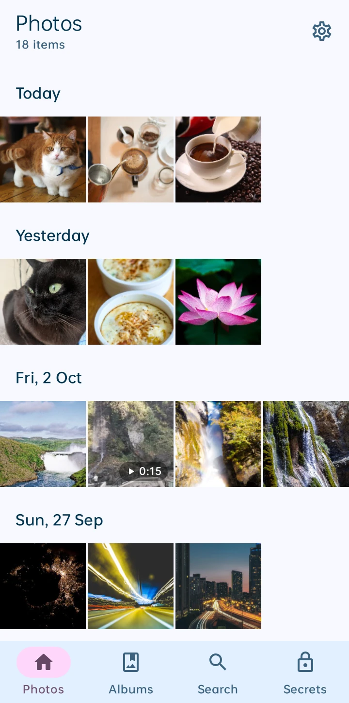
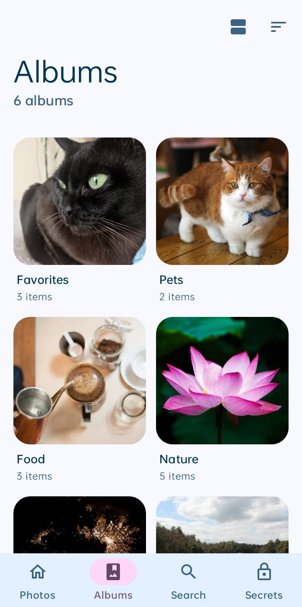
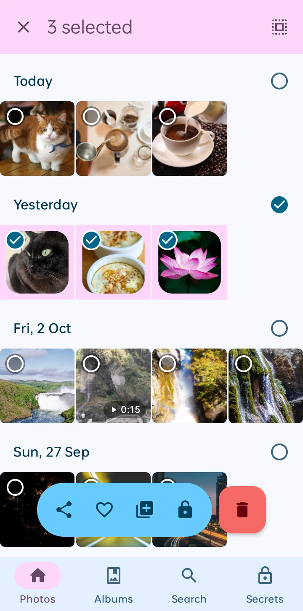
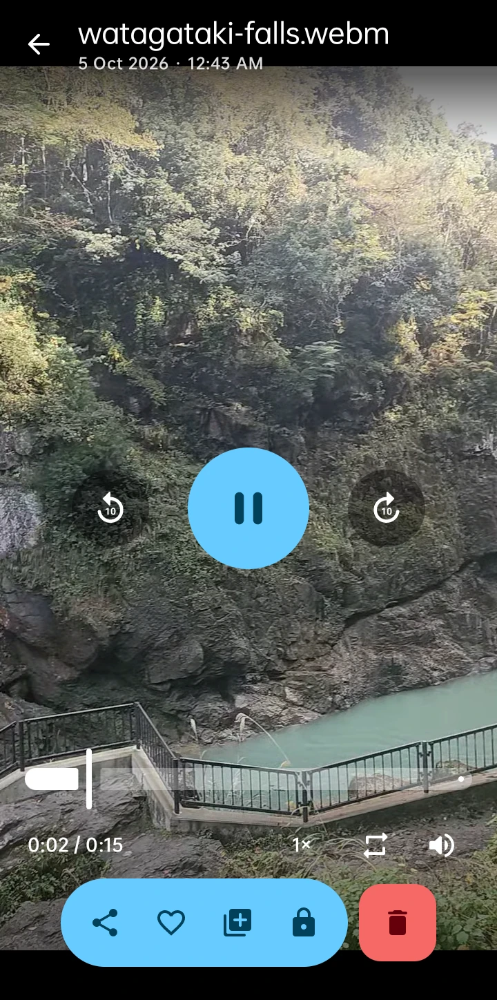
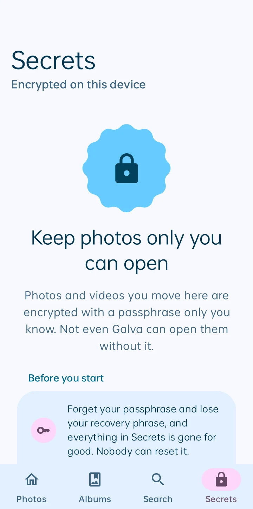

<div align="center">

# Galva

**A private, local-only photo and video gallery for Android.**

[](LICENSE)


</div>

Galva is a gallery application for Android that presents the photos and videos already stored on a
device. It indexes the device's media library locally, keeps that index current in the background,
and serves every screen from it, so browsing remains fast regardless of library size. Galva also
includes **Secrets**, an encrypted vault protected by a passphrase that only its owner knows.

Galva operates entirely offline. It does not request network access, requires no account, and
contains no advertising, analytics or tracking of any kind.

## Screenshots

| Timeline | Albums | Multi-select | Video player | Secrets |
| :---: | :---: | :---: | :---: | :---: |
|  |  |  |  |  |

<sub>Screenshots use public-domain (CC0) sample images; see [Sample media](#sample-media).</sub>

## Features

- **Timeline.** All media in a single grid, grouped by capture date with the newest first. A day
  header selects every item from that day.
- **Albums.** Device folders, a Favorites album, and user-created albums. User albums hold
  references only, so adding an item never copies or moves a file.
- **Search.** Free-text search across file and folder names, with filters for photos, videos and
  favorites.
- **Viewer.** An immersive, edge-to-edge viewer with pinch to zoom for photos and full playback
  controls for video, including seeking, double-tap to skip, playback speed, looping and mute.
- **Multi-select.** Share, favorite, add to an album, move to Secrets or delete in bulk from a
  floating toolbar.
- **Secrets.** An encrypted vault for photos and videos, described in
  [Privacy and security](#privacy-and-security).
- **Material 3 Expressive design.** Dynamic color from the wallpaper or a chosen accent, an
  optional pure-black dark theme, shape morphing, expressive motion and shared-element transitions.
- **Adaptive layout.** A navigation bar on phones and a navigation rail on wide or short windows,
  with grid density that scales to the window size.
- **Live updates.** Changes made by other apps, such as a newly captured photo, appear without a
  manual refresh.
- **Partial media access.** Android 14's "Select photos" permission is fully supported.

## Privacy and security

Galva is designed so that personal media never leaves the device:

- The application does not declare the `INTERNET` permission and therefore cannot transmit data.
- Deletion always passes through the system confirmation dialog, and the local index is updated only
  after the user confirms.
- **Secrets** encrypts each item with its own key, held in an index sealed by a master key that is
  derived from the user's passphrase with Argon2id. The vault file is additionally wrapped by a key
  in the Android Keystore, backed by StrongBox where available. A 24-word recovery phrase can replace
  a forgotten passphrase.
- Decrypted content is never written to disk, removing an item from the vault rotates its keys so
  that deletion is permanent, the vault is excluded from Android backups, and screenshots are blocked
  while it is open.

The full policy is available in [PRIVACY.md](PRIVACY.md), and the terms of use in
[TERMS.md](TERMS.md). Both documents are also shown inside the application under
**Settings › Legal**.

## Getting started

### Requirements

- Android Studio, or JDK 17 or newer with the Android SDK
- A device running Android 10 (API 29) or newer
- A `local.properties` file whose `sdk.dir` points to the Android SDK

### Build and install

```bash
git clone https://github.com/AbrarShakhi/Galva.git
cd Galva
./gradlew :app:installDebug
```

On first launch Galva requests access to photos and videos. It can read only what is granted: full
access shows the entire library, while "Select photos" shows only the chosen items.

## Development

```bash
./gradlew :app:assembleDebug               # build a debug APK
./gradlew testDebugUnitTest                # run all JVM unit tests
./gradlew :core:vault:testDebugUnitTest    # run the tests of a single module
./gradlew :app:connectedDebugAndroidTest   # instrumented tests (connected device required)
./gradlew :app:lintDebug                   # Android Lint
```

Dependencies are declared in the version catalog at `gradle/libs.versions.toml`, and shared build
configuration lives in convention plugins under `build-logic/`. Room schemas are exported to
`app/schemas/` and checked in; every schema change ships with a hand-written migration.

## Architecture

Galva follows a unidirectional data flow. MediaStore is read in a single place and mirrored into
Room, and every screen reads from that mirror.

```
MediaStore ──► MediaSyncManager ──► Room ──► Repository ──► UseCase ──► MviViewModel ──► Compose
   ▲                  ▲                                                        │
   └── ContentObserver┘                                               Intent ◄─┘
```

### Modules

The project is split into Gradle modules following the structure recommended in Google's
[guide to app modularization](https://developer.android.com/topic/modularization).

| Module | Responsibility |
| --- | --- |
| `:app` | Application entry point, app shell, navigation and dependency graph |
| `:feature:gallery`, `:feature:albums`, `:feature:search`, `:feature:viewer`, `:feature:secrets`, `:feature:settings` | Screens, one feature per module; features never depend on one another |
| `:core:designsystem` | Theme, shapes, motion and generic components |
| `:core:ui` | Shared application UI: media grids, toolbars, viewer chrome and vault forms |
| `:core:domain` | Use cases |
| `:core:data` | Repositories, media synchronization and settings |
| `:core:database` | Room database, DAOs and migrations |
| `:core:mediastore` | MediaStore access and permissions |
| `:core:vault` | The encrypted Secrets vault |
| `:core:model`, `:core:common` | Domain models and shared coroutine configuration |

### Key design decisions

- **Incremental synchronization.** The index is reconciled with MediaStore by a fingerprint diff of
  identifiers and modification times, so only new or changed items are re-read. Passes are
  serialized, and a read that would remove a large share of the index must be confirmed by a second
  read before it is applied, which protects favorites and album membership from a faulty read.
- **Model-View-Intent presentation.** Each screen exposes a single immutable state and receives
  intents that are reduced one at a time. One-off events such as messages and system dialogs are
  modeled as state, as recommended in Google's architecture guidance.
- **Navigation 3.** Each tab keeps its own back stack, which survives process death. Routes carry
  identities rather than data, so large lists are never serialized into navigation state.

## Tech stack

Kotlin · Jetpack Compose · Material 3 Expressive · Navigation 3 · Koin · Room · DataStore · Coil 3 ·
Media3 ExoPlayer · Lottie · MaterialKolor · Tink · Argon2 · Coroutines and Flow · KSP

## Contributing

Bug reports and suggestions are welcome through
[GitHub Issues](https://github.com/AbrarShakhi/Galva/issues). Before opening a pull request, please
make sure the project builds and that `./gradlew testDebugUnitTest` passes.

## License

Galva is released under the [MIT License](LICENSE). The application icon is subject to the
attribution listed under [Credits](#credits) and is not covered by the MIT License.

## Credits

Galva is built on a number of open-source libraries, listed with their licenses in
[CREDITS.md](CREDITS.md).

- Application icon: <a href="https://www.flaticon.com/free-icons/letter-g" title="letter g icons">Letter g icons created by Maniprasanth - Flaticon</a>

### Sample media

The screenshots in this document show the following images and video, all dedicated to the public
domain under [CC0 1.0](https://creativecommons.org/publicdomain/zero/1.0/). Attribution is not
required but is given with thanks.

| Title | Creator | Source | License |
| --- | --- | --- | --- |
| [Munchkin cat 2 (cropped)](https://commons.wikimedia.org/w/index.php?curid=131022178) | Tasy Hong | Wikimedia Commons | CC0 1.0 |
| [Manual drip (pour-over) coffee](https://commons.wikimedia.org/w/index.php?curid=70214599) | Kim Sanso | Wikimedia Commons | CC0 1.0 |
| [Coffee with milk (563800)](https://commons.wikimedia.org/w/index.php?curid=46261185) | shixugang | Wikimedia Commons | CC0 1.0 |
| [Male Chocolate Burmese Cat](https://commons.wikimedia.org/w/index.php?curid=77710261) | Psypherium | Wikimedia Commons | CC0 1.0 |
| [Food Bowls](https://stocksnap.io/photo/food-bowls-YSW2MR8MBP) | Tim Sullivan | StockSnap | CC0 1.0 |
| [Lotus flower (978659)](https://commons.wikimedia.org/w/index.php?curid=46646340) | Hong Zhang (jennyzhh2008) | Wikimedia Commons | CC0 1.0 |
| [Nastapoka River Waterfall](https://commons.wikimedia.org/w/index.php?curid=19240446) | NicolasPerrault | Wikimedia Commons | CC0 1.0 |
| [Watagataki Falls (Video)](https://commons.wikimedia.org/wiki/File:Watagataki_Falls_(Video).webm) | Wikimedia Commons contributor | Wikimedia Commons | CC0 1.0 |
| [Shosenkyo-Waterfall](https://commons.wikimedia.org/w/index.php?curid=12801001) | Jordy Meow | Wikimedia Commons | CC0 1.0 |
| [Pitniani waterfall](https://commons.wikimedia.org/w/index.php?curid=49233971) | Wikimedia Commons contributor | Wikimedia Commons | CC0 1.0 |
| [Melbourne at night from the International Space Station](https://commons.wikimedia.org/w/index.php?curid=127848764) | European Space Agency | Wikimedia Commons | CC0 1.0 |
| [Road Street](https://stocksnap.io/photo/road-street-WYR8HIVM8J) | Negative Space | StockSnap | CC0 1.0 |
| [Cityscape Skyline](https://stocksnap.io/photo/cityscape-skyline-KDOIQSH4ZW) | Verne Ho | StockSnap | CC0 1.0 |
| [Turquoise mountain lake](https://commons.wikimedia.org/w/index.php?curid=61645387) | Volker Schnäbele | Wikimedia Commons | CC0 1.0 |
| [Boathouse on a mountain lake](https://commons.wikimedia.org/w/index.php?curid=61911519) | Luca Bravo | Wikimedia Commons | CC0 1.0 |
| [Fort mountain lake 02](https://commons.wikimedia.org/w/index.php?curid=18792207) | Thomsonmg2000 | Wikimedia Commons | CC0 1.0 |
| [Dharmadam Nurumbil Beach Sunset](https://commons.wikimedia.org/w/index.php?curid=172128589) | Msudhinm | Wikimedia Commons | CC0 1.0 |
| [Rockaway Beach Sunset](https://commons.wikimedia.org/w/index.php?curid=92811251) | Romain Guy | Wikimedia Commons | CC0 1.0 |
